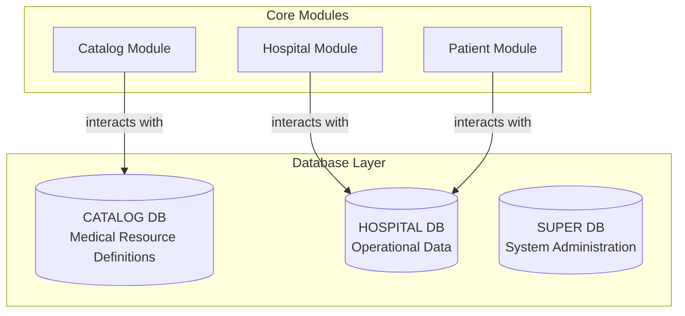

# CuraSync-server

A comprehensive healthcare management backend system built with NestJS that provides a robust catalog infrastructure for organizing and managing medical resources within healthcare facilities.

## System Overview

CuraSync-server is designed to streamline healthcare operations through a modular architecture that manages:

- Hospital departments and specialized units
- Medical services and procedures
- Laboratory tests with standardized categorization
- Imaging procedures with modality tracking
- Medication management with dosage tracking
- Patient records and transfers
- Medical billing and charging

## Architecture

The system is built around three interconnected databases:



### Catalog Database
Stores definitions of all medical resources including:
- Departments
- Units
- Services
- Laboratory tests
- Imaging procedures
- Medications
- Disposables
- Vendors

### Hospital Database
Manages operational data including:
- Hospital information
- Patient records
- Medical orders
- Transfers
- Billing information

### Super Database
Handles system administration including user management and permissions.

## Technology Stack

- **Framework**: NestJS
- **Language**: TypeScript
- **Database**: MongoDB with Mongoose ODM
- **Authentication**: JWT-based authentication
- **Security**: Data encryption for sensitive information

## Core Features

### Comprehensive Medical Catalog
Manages a complete catalog of medical resources with standardized schemas:
- Department catalog
- Unit catalog
- Service catalog
- Lab test catalog
- Imaging catalog
- Medicine catalog
- Disposable catalog
- Vendor catalog

### Patient Management
- Complete patient records with demographic information
- Medical file management
- Transfer between departments/units

### Medical Order Processing
- Medication orders with dosage tracking
- Laboratory test orders
- Imaging procedure orders

### Hospital Management
- Hospital registration and licensing
- Department and unit organization
- Service pricing and availability

## Getting Started

### Prerequisites
- Node.js (v14 or higher)
- npm (v6 or higher)
- MongoDB (v4 or higher)
- Environment variables configured (see below)

### Installation

```bash
# Clone the repository
git clone https://github.com/ahmedzaghloul25/CuraSync-server.git

# Navigate to project directory
cd CuraSync-server

# Install dependencies
npm install

# Set up environment variables
cp .env.example .env
# Edit .env with your configuration
```

### Environment Variables

```
# Database Configuration
MONGO_URI=mongodb://localhost:27017/
CATALOG_DB_NAME=curasync_catalog
HOSPITAL_DB_NAME=curasync_hospital
SUPER_DB_NAME=curasync_super

# Security
JWT_SECRET=your_jwt_secret_key
ENCRYPTION_PASS=your_encryption_password

# Email Configuration (for notifications)
EMAIL_HOST=smtp.example.com
EMAIL_USER=user@example.com
EMAIL_PASS=your_email_password
```

### Running the Application

```bash
# Development mode
npm run start

# Watch mode
npm run start:dev

# Production mode
npm run start:prod
```

## API Documentation

The API documentation is available at `/api/docs` when the server is running.

## Project Structure

```
curasync-server/
├── common/                  # Common utilities and types
│   ├── services/            # Shared services (email, encryption, etc.)
│   ├── types/               # Type definitions and enumerations
│   └── utils/               # Utility functions
├── src/
│   ├── catalog/             # Catalog module for medical resources
│   ├── DB/                  # Database schemas and repositories
│   │   ├── repository/      # Repository services
│   │   └── schemas/         # MongoDB schemas
│   │       ├── catalog/     # Catalog schemas
│   │       ├── hospital/    # Hospital schemas
│   │       └── patient/     # Patient schemas
│   ├── hospital/            # Hospital management module
│   ├── patient/             # Patient management module
│   └── main.ts              # Application entry point
└── test/                    # Test files
```

## Contributing

1. Fork the repository
2. Create your feature branch (`git checkout -b feature/amazing-feature`)
3. Commit your changes (`git commit -m 'Add some amazing feature'`)
4. Push to the branch (`git push origin feature/amazing-feature`)
5. Open a Pull Request

## License

This project is licensed under the MIT License - see the LICENSE file for details.
